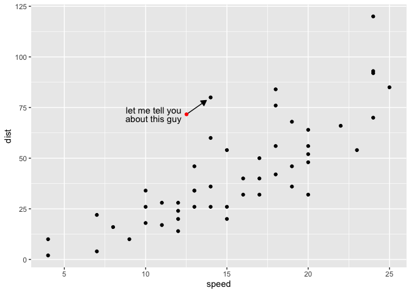
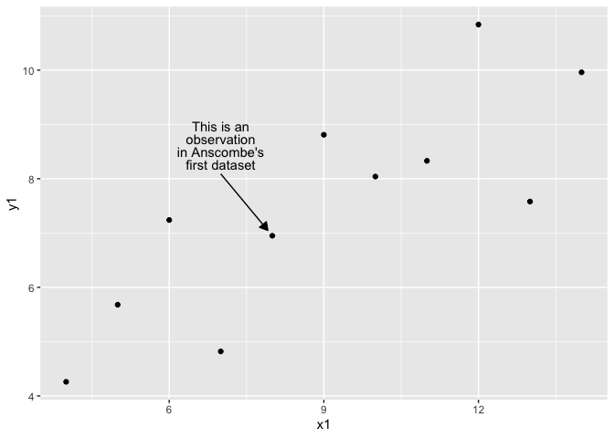

  - [Part 0. Proposal](#part-0-proposal)
  - [Part I. Work out functionality 🚧
    ✅](#part-i-work-out-functionality--)
      - [Try out compute function](#try-out-compute-function)
      - [Trying out Stat within plot](#trying-out-stat-within-plot)
  - [Pass stat to user-facing
    function](#pass-stat-to-user-facing-function)
  - [Part II. Packaging and documentation 🚧
    ✅](#part-ii-packaging-and-documentation--)
      - [Phase 1. Minimal working
        package](#phase-1-minimal-working-package)
      - [Phase 3: Settling and testing 🚧
        ✅](#phase-3-settling-and-testing--)
      - [Phase 4. Promote to wider audience… 🚧
        ✅](#phase-4-promote-to-wider-audience--)
      - [Phase 5: Harden/commit: Submit to CRAN/RUniverse 🚧
        ✅](#phase-5-hardencommit-submit-to-cranruniverse--)
  - [Appendix: Reports, Environment](#appendix-reports-environment)
      - [Description file complete? 🚧 ✅](#description-file-complete--)
      - [Environment 🚧 ✅](#environment--)
      - [`devtools::check()` report](#devtoolscheck-report)
      - [Package directory file tree](#package-directory-file-tree)

<!-- badges: start -->

[](https://lifecycle.r-lib.org/articles/stages.html#experimental)
<!-- badges: end -->

# Part 0. Proposal

Proposing the {ggcallout} package\! 🦄
<!-- (typical package introduction write up; but actually aspirational) -->

The goal of {ggcallout} is to make callouts easier. Maybe just a proof
of concept and we’ll just look at scatterplots to start.

Without the package, we live in the effort-ful world that follows 🏋:
It’s so effortful, I’m not gonna save filling this out for later…

``` r
x <- 4

2*x
#> [1] 8
```

With the {ggcallout} package, we’ll live in a different world (🦄 🦄 🦄)
where the task is a snap 🫰:

Proposed API:

``` 

library(ggcallout)

gapminder::gapminder |>
  filter(year == 2002) |>
ggplot() + 
  aes(gdpPercap, lifeExp, id = country) +
  geom_point(color = "darkgray") + 
  # labels as 'Norway' with default link length and padding
  geom_labellink(which_id = "Norway",
                 label_direction = -120) +
  # label is specified by the user               
  geom_labellink(which_id = "Brazil",
                 label = "People want to\nknow about Brazil",
                 label_direction = -70,
                 prop_range = .2) + 
```

# Part I. Work out functionality 🚧 ✅

Here is a function that will do some work…

``` r
readme2pkg::chunk_to_r("StatLabellink")
```

``` r
compute_labellink <- function(data, scales, label_direction = 180 + 45, prop_range = .1, prop_pointer_pad = .0175, hjust = NULL, vjust = NULL, which_index = NULL, which_id = NULL){
  
  if(is.null(data$id)){data$id <- "hello world"}
  if(is.null(which_index)){which_index <- which(data$id %in% which_id)}
  
  data$default_label <- data$id
  
  xmean <- mean(data$x)
  ymean <- mean(data$y)
  
  range_x <- diff(range(data$x))
  range_y <- diff(range(data$y)) # look at range of plot?
  xdir <- cos(pi*label_direction/180)
  ydir <- sin(pi*label_direction/180)
  xpush <- range_x * prop_range * xdir
  ypush <- range_y * prop_range * ydir
  
  xpointer_pad <- range_x *xdir* prop_pointer_pad
  ypointer_pad <- range_y *ydir* prop_pointer_pad
  
  more_x_than_y <- abs(xdir) > abs(ydir)
  
  if(is.null(hjust)){hjust <- ifelse(more_x_than_y, sign(xdir) != 1, .5)}
  if(is.null(vjust)){vjust <- ifelse(more_x_than_y, .5, sign(ydir) != 1)}

  data |> 
    dplyr::mutate(x = x + xpush) |>
    dplyr::mutate(y = y + ypush) |>
    dplyr::mutate(xend = .data$x - (xpush - xpointer_pad)) |>
    dplyr::mutate(yend = .data$y - (ypush - ypointer_pad)) |>
    dplyr::mutate(hjust = hjust) |>
    dplyr::mutate(vjust = vjust) |> 
    dplyr::slice(which_index)
  
}

StatLabellink <- ggplot2::ggproto("Labellink",
                         ggplot2::Stat,
                         compute_panel = compute_labellink,
                         default_aes = 
                           ggplot2::aes(label = ggplot2::after_stat(default_label)))
```

## Try out compute function

``` r
library(tidyverse)
#> ── Attaching core tidyverse packages ─────────────────── tidyverse 2.0.0.9000 ──
#> ✔ dplyr     1.1.0          ✔ readr     2.1.4     
#> ✔ forcats   1.0.0          ✔ stringr   1.5.0     
#> ✔ ggplot2   3.4.4.9000     ✔ tibble    3.2.1     
#> ✔ lubridate 1.9.2          ✔ tidyr     1.3.0     
#> ✔ purrr     1.0.1          
#> ── Conflicts ────────────────────────────────────────── tidyverse_conflicts() ──
#> ✖ dplyr::filter() masks stats::filter()
#> ✖ dplyr::lag()    masks stats::lag()
#> ℹ Use the conflicted package (<http://conflicted.r-lib.org/>) to force all conflicts to become errors
gapminder::gapminder |>
  filter(year == 2002) |> 
  select(id = country, x = lifeExp, y = gdpPercap) |>
  compute_labellink(which_id = "Chile")
#> # A tibble: 1 × 8
#>   id        x     y default_label  xend   yend hjust vjust
#>   <fct> <dbl> <dbl> <fct>         <dbl>  <dbl> <lgl> <dbl>
#> 1 Chile  74.8 7636. Chile          77.3 10229. TRUE    0.5

gapminder::gapminder |>
  filter(year == 2002) |> 
  select(id = country, x = lifeExp, y = gdpPercap) |>
  compute_labellink(which_index = 3)
#> # A tibble: 1 × 8
#>   id          x     y default_label  xend  yend hjust vjust
#>   <fct>   <dbl> <dbl> <fct>         <dbl> <dbl> <lgl> <dbl>
#> 1 Algeria  68.0 2145. Algeria        70.5 4738. TRUE    0.5

gapminder::gapminder |>
  filter(year == 2002) |> 
  select(x = lifeExp, y = gdpPercap) |>
  compute_labellink(which_index = 3)
#> Warning: Unknown or uninitialised column: `id`.
#> # A tibble: 1 × 8
#>       x     y id          default_label  xend  yend hjust vjust
#>   <dbl> <dbl> <chr>       <chr>         <dbl> <dbl> <lgl> <dbl>
#> 1  68.0 2145. hello world hello world    70.5 4738. TRUE    0.5
```

## Trying out Stat within plot

``` r
gapminder::gapminder |>
  filter(year == 2002) |> 
  ggplot() + 
  aes(id = country, x = lifeExp, y = gdpPercap) + 
  geom_point() + 
  layer("label", "labellink", position = "identity",
        params = list(which_id = "Chile")) + 
  layer("segment", "labellink", position = "identity",
        params = list(which_id = "Chile")) + 
  scale_x_log10()
```

<!-- -->

``` r

ggplot(cars) + 
  aes(speed, dist) + 
  geom_point() + 
  layer("segment", 
        "labellink", 
        position = "identity", 
        # data = cars[23,], 
        params = list(which_index = 23, arrow = 
                        arrow(ends = "last", 
                              length = unit(.1, "inches"), 
                              type = "closed"))) +
  layer("label", 
        "labellink", 
        position = "identity",  
        # data = cars[23,],
        params = list(which_index = 23, 
                      label = "let me tell you about this guy" |> str_wrap(15),
                      alpha = 0,
                      lineheight = .8,
                      label.size = 0,
                      label.padding = unit(0.7, "lines"))) + 
  layer("point",
        "labellink",
        position = "identity",
        # data = cars[23,],
        params = list(which_index = 23, 
                      color = "red"))
```

<!-- -->

# Pass stat to user-facing function

``` r
readme2pkg::chunk_to_r("geom_labellink")
```

``` r
geom_labellink <- function(  mapping = NULL,
  data = NULL,
  position = "identity",
  na.rm = FALSE,
  show.legend = NA,
  inherit.aes = TRUE, ...){

  
  list( 
    
    ggplot2::layer("segment", 
        "labellink", 
        position = position, 
        data = data, 
        mapping = mapping,
            show.legend = show.legend,
    inherit.aes = inherit.aes,
        params = list(arrow = 
                        arrow(ends = "last", 
                              length = unit(.1, "inches"), 
                              type = "closed"), na.rm = na.rm,
                      ...)),
    
  ggplot2::layer("label", 
        "labellink", 
        position = position, 
        data = data, 
        mapping = mapping, 
            show.legend = show.legend,
    inherit.aes = inherit.aes,
        params = list(
                      alpha = 0,
                      lineheight = .8,
                      label.size = 0,
                      label.padding = unit(0.4, "lines"), 
                      na.rm = na.rm,
                      ...)) 
  )

  
}
```

``` r
gapminder::gapminder |> 
  filter(year == 2002) |> 
  ggplot() + 
  aes(x = gdpPercap, y = lifeExp, id = country) + 
  geom_point(color = "darkgrey") + 
  geom_labellink(which_id = "Chile",
                             label_direction = 45) + 
  geom_labellink(which_id = "Brazil",
                             label_direction = -65,
                             label = "Brazil is a pretty\n interesting case")
#> Warning in geom_labellink(which_id = "Brazil", label_direction = -65, label =
#> "Brazil is a pretty\n interesting case"): Ignoring unknown parameters: `label`
```

<!-- -->

``` r

last_plot() + 
  scale_x_log10()
```

<!-- -->

``` r

last_plot() %+% 
  (gapminder::gapminder |> 
  filter(year == 2002) |> 
    filter(gdpPercap > 3000))
```

<!-- -->

``` r

chickwts |>
  ggplot() + 
  aes(weight, weight) + 
  geom_point() + 
  geom_labellink(which_index = 2)
```

<!-- -->

``` r

chickwts |>
  ggplot() + 
  aes(weight, feed, id = weight) + 
  geom_point() + 
  geom_labellink(which_id = 179,
                 label_direction = -45)
```

<!-- -->

``` r

pressure |>
  ggplot() + 
  aes(temperature, pressure, id = temperature) + 
  geom_point() + 
  geom_path() + 
  geom_labellink(which_id = 20,
                 aes(label = "At a low temp of 20\n degrees pressure is low"),
                 label_direction = 70) + 
  geom_labellink(which_id = 300,
                 label = "At 300 degress,\npressure is building",
                 label_direction = 160) + 
  geom_labellink(which_index = nrow(pressure),
                 label = "At the highest temp in the study, we're\nin a high pressure situation") + 
  ggstamp::stamp_label(x = 80, y = 425, 
                       label = "You may have heard of the pressure dataset. But did you know these facinating details?" |> str_wrap(20))
#> Warning in geom_labellink(which_id = 300, label = "At 300 degress,\npressure is
#> building", : Ignoring unknown parameters: `label`
#> Warning in geom_labellink(which_index = nrow(pressure), label = "At the highest
#> temp in the study, we're\nin a high pressure situation"): Ignoring unknown
#> parameters: `label`
```

<!-- -->

``` r


airquality |>
  remove_missing() |>
  ggplot() + 
  aes(Temp, Ozone, id = Temp) + 
  geom_point() + 
  geom_labellink(which_index = 5,
                 label_direction = 100,
                 hjust = .5,
                 prop_range = .2,
                 label = "Here is a low temperature observation within the distribution" |> str_wrap(20))
#> Warning: Removed 42 rows containing missing values or values outside the scale
#> range.
#> Warning in geom_labellink(which_index = 5, label_direction = 100, hjust = 0.5,
#> : Ignoring unknown parameters: `label`
```

<!-- -->

``` r
anscombe |>
  ggplot() + 
  aes(x1, y1) + 
  geom_point() + 
  geom_labellink(which_index = 2,
                 label = "This is an observation in Anscombe's first dataset" |> str_wrap(15),
                 prop_range = .2,
                 label_direction = 120
                 )
#> Warning in geom_labellink(which_index = 2, label = str_wrap("This is an
#> observation in Anscombe's first dataset", : Ignoring unknown parameters:
#> `label`
```

<!-- -->

``` r

gapminder::gapminder |>
  filter(year == 2002) |>
  ggplot() + 
  aes(gdpPercap, lifeExp, id = country) + 
  geom_point() + 
  facet_wrap(~continent) + 
  geom_labellink(which_id = "Chile",
                 label_direction = -45,
                 prop_range = .5)
```

<!-- -->

``` r


mpg |>
  ggplot() + 
  aes(cty, hwy) + 
  geom_point(aes(color = fl), alpha = .7) + 
  geom_labellink(which_index = 50,
                 label = "A point represents a single make and model in the mpg dataset: 'Fuel economy data from 1999 to 2008 for 38 popular models of cars'" |> str_wrap(15),
                 label_direction = 110,
                 prop_range = .2) + 
    geom_labellink(which_id = "c",
                   aes(id = fl),
                 label_direction = 120,
                 label = "fuel type is c") + 
    geom_labellink(which_id = c("d","e") ,
                   aes(id = fl),
                 label_direction = -45) 
#> Warning in geom_labellink(which_index = 50, label = str_wrap("A point
#> represents a single make and model in the mpg dataset: 'Fuel economy data from
#> 1999 to 2008 for 38 popular models of cars'", : Ignoring unknown parameters:
#> `label`
#> Warning in geom_labellink(which_id = "c", aes(id = fl), label_direction = 120,
#> : Ignoring unknown parameters: `label`
#> Warning in geom_labellink(which_id = "c", aes(id = fl), label_direction = 120, : Ignoring unknown aesthetics: id
#> Ignoring unknown aesthetics: id
#> Warning in geom_labellink(which_id = c("d", "e"), aes(id = fl), label_direction = -45): Ignoring unknown aesthetics: id
#> Ignoring unknown aesthetics: id
```

<!-- -->

``` r

mtcars |>
  rownames_to_column() |>
  mutate(make = factor(rowname)) |>
  head() |>
  ggplot2::remove_missing() |>
  ggplot() + 
  aes(x = wt, y = mpg, id = make) |>
  geom_point() + 
  geom_labellink(which_id = "Mazda RX4",
                 label_direction = 45,
                 label = "hello")
#> Warning in geom_point(aes(x = wt, y = mpg, id = make)): Ignoring unknown
#> aesthetics: id
#> Warning in geom_labellink(which_id = "Mazda RX4", label_direction = 45, :
#> Ignoring unknown parameters: `label`
#> Warning in mean.default(data$x): argument is not numeric or logical: returning
#> NA
#> Warning in mean.default(data$y): argument is not numeric or logical: returning
#> NA
#> Warning in min(x, na.rm = na.rm): no non-missing arguments to min; returning
#> Inf
#> Warning in max(x, na.rm = na.rm): no non-missing arguments to max; returning
#> -Inf
#> Warning in min(x, na.rm = na.rm): no non-missing arguments to min; returning
#> Inf
#> Warning in max(x, na.rm = na.rm): no non-missing arguments to max; returning
#> -Inf
#> Warning: Computation failed in `labellink()`.
#> Caused by error in `dplyr::mutate()`:
#> ℹ In argument: `y = y + ypush`.
#> Caused by error:
#> ! object 'y' not found
#> Warning in mean.default(data$x): argument is not numeric or logical: returning
#> NA
#> Warning in mean.default(data$y): argument is not numeric or logical: returning
#> NA
#> Warning in min(x, na.rm = na.rm): no non-missing arguments to min; returning
#> Inf
#> Warning in max(x, na.rm = na.rm): no non-missing arguments to max; returning
#> -Inf
#> Warning in min(x, na.rm = na.rm): no non-missing arguments to min; returning
#> Inf
#> Warning in max(x, na.rm = na.rm): no non-missing arguments to max; returning
#> -Inf
#> Warning: Computation failed in `labellink()`.
#> Caused by error in `dplyr::mutate()`:
#> ℹ In argument: `y = y + ypush`.
#> Caused by error:
#> ! object 'y' not found
```

<!-- -->

``` r

mtcars |>
  rownames_to_column() |>
  mutate(make = factor(rowname)) |>
  head() |>
  ggplot2::remove_missing() |>
  ggplot() + 
  aes(x = wt, y = mpg, id = make) |>
  geom_point() + 
  geom_labellink(which_index = 1)
#> Warning in geom_point(aes(x = wt, y = mpg, id = make)): Ignoring unknown
#> aesthetics: id
#> Warning in mean.default(data$x): argument is not numeric or logical: returning
#> NA
#> Warning in mean.default(data$y): argument is not numeric or logical: returning
#> NA
#> Warning in min(x, na.rm = na.rm): no non-missing arguments to min; returning
#> Inf
#> Warning in max(x, na.rm = na.rm): no non-missing arguments to max; returning
#> -Inf
#> Warning in min(x, na.rm = na.rm): no non-missing arguments to min; returning
#> Inf
#> Warning in max(x, na.rm = na.rm): no non-missing arguments to max; returning
#> -Inf
#> Warning: Computation failed in `labellink()`.
#> Caused by error in `dplyr::mutate()`:
#> ℹ In argument: `y = y + ypush`.
#> Caused by error:
#> ! object 'y' not found
#> Warning in mean.default(data$x): argument is not numeric or logical: returning
#> NA
#> Warning in mean.default(data$y): argument is not numeric or logical: returning
#> NA
#> Warning in min(x, na.rm = na.rm): no non-missing arguments to min; returning
#> Inf
#> Warning in max(x, na.rm = na.rm): no non-missing arguments to max; returning
#> -Inf
#> Warning in min(x, na.rm = na.rm): no non-missing arguments to min; returning
#> Inf
#> Warning in max(x, na.rm = na.rm): no non-missing arguments to max; returning
#> -Inf
#> Warning: Computation failed in `labellink()`.
#> Caused by error in `dplyr::mutate()`:
#> ℹ In argument: `y = y + ypush`.
#> Caused by error:
#> ! object 'y' not found
```

<!-- -->

``` r


mtcars |>
  rownames_to_column() |>
  mutate(rowname = factor(rowname)) |>
  select(x = wt, y = mpg, id = rowname) |>
  compute_labellink(which_id = "Mazda RX4")
#>          x       y        id default_label     xend    yend hjust vjust
#> 1 2.343451 19.3383 Mazda RX4     Mazda RX4 2.571604 20.7092  TRUE   0.5


gapminder::gapminder |> 
  filter(year == 2002) |>
  select(x = gdpPercap, y = lifeExp, id = country) |>
  compute_labellink(which_id = "Chile")
#> # A tibble: 1 × 8
#>       x     y id    default_label   xend  yend hjust vjust
#>   <dbl> <dbl> <fct> <fct>          <dbl> <dbl> <lgl> <dbl>
#> 1 7636.  74.8 Chile Chile         10229.  77.3 TRUE    0.5
```

``` r
nhl_player_births <- readr::read_csv('https://raw.githubusercontent.com/rfordatascience/tidytuesday/master/data/2024/2024-01-09/nhl_player_births.csv')
#> Rows: 8474 Columns: 9
#> ── Column specification ────────────────────────────────────────────────────────
#> Delimiter: ","
#> chr  (5): first_name, last_name, birth_city, birth_country, birth_state_prov...
#> dbl  (3): player_id, birth_year, birth_month
#> date (1): birth_date
#> 
#> ℹ Use `spec()` to retrieve the full column specification for this data.
#> ℹ Specify the column types or set `show_col_types = FALSE` to quiet this message.


set.seed(1245)
nhl_player_births |> 
  sample_frac(.1) |>
  ggplot2::remove_missing() |>
  mutate(birth_date_2020 = birth_date %>% str_replace("....", "2000") %>% as_date()) |>
  mutate(first_last = paste(first_name, last_name)) |>
  ggplot() + 
  aes(x = birth_month, 
      y = birth_year,
      id = first_last) |>
  geom_point() + 
  geom_labellink(which_id = "Donald Brashear")
#> Warning: Removed 166 rows containing missing values or values outside the scale
#> range.
#> Warning in geom_point(aes(x = birth_month, y = birth_year, id = first_last)):
#> Ignoring unknown aesthetics: id
#> Warning in mean.default(data$x): argument is not numeric or logical: returning
#> NA
#> Warning in mean.default(data$y): argument is not numeric or logical: returning
#> NA
#> Warning in min(x, na.rm = na.rm): no non-missing arguments to min; returning
#> Inf
#> Warning in max(x, na.rm = na.rm): no non-missing arguments to max; returning
#> -Inf
#> Warning in min(x, na.rm = na.rm): no non-missing arguments to min; returning
#> Inf
#> Warning in max(x, na.rm = na.rm): no non-missing arguments to max; returning
#> -Inf
#> Warning: Computation failed in `labellink()`.
#> Caused by error in `dplyr::mutate()`:
#> ℹ In argument: `y = y + ypush`.
#> Caused by error:
#> ! object 'y' not found
#> Warning in mean.default(data$x): argument is not numeric or logical: returning
#> NA
#> Warning in mean.default(data$y): argument is not numeric or logical: returning
#> NA
#> Warning in min(x, na.rm = na.rm): no non-missing arguments to min; returning
#> Inf
#> Warning in max(x, na.rm = na.rm): no non-missing arguments to max; returning
#> -Inf
#> Warning in min(x, na.rm = na.rm): no non-missing arguments to min; returning
#> Inf
#> Warning in max(x, na.rm = na.rm): no non-missing arguments to max; returning
#> -Inf
#> Warning: Computation failed in `labellink()`.
#> Caused by error in `dplyr::mutate()`:
#> ℹ In argument: `y = y + ypush`.
#> Caused by error:
#> ! object 'y' not found
```

<!-- -->

``` r
StatSum$compute_panel
#> <ggproto method>
#>   <Wrapper function>
#>     function (...) 
#> compute_panel(...)
#> 
#>   <Inner function (f)>
#>     function (data, scales) 
#> {
#>     if (is.null(data$weight)) 
#>         data$weight <- 1
#>     group_by <- setdiff(intersect(names(data), ggplot_global$all_aesthetics), 
#>         "weight")
#>     counts <- count(data, group_by, wt_var = "weight")
#>     counts <- rename(counts, c(freq = "n"))
#>     counts$prop <- stats::ave(counts$n, counts$group, FUN = prop.table)
#>     counts
#> }
  

nhl_player_births |> 
  mutate(birth_date2020 = str_replace(birth_date, "....", "2020") %>% as.Date()) |>
  filter(birth_year >= 1970, birth_year <= 2000) |>
  ggplot() + 
  aes(x = month(birth_date, label = T), 
      y = year(birth_date),
      size = NULL) + 
  layer(stat = StatSum, geom = GeomTile, position = "identity") + 
  aes(fill = after_stat(n)) +
  aes(label = after_stat(n)) +
  layer(stat = StatSum, geom = GeomText, position = "identity",
        params = list(color = "gray")) + 
  scale_fill_viridis_c()
#> Warning: Using `size` aesthetic for lines was deprecated in ggplot2 3.4.0.
#> ℹ Please use `linewidth` instead.
#> This warning is displayed once every 8 hours.
#> Call `lifecycle::last_lifecycle_warnings()` to see where this warning was
#> generated.
```

<!-- -->

# Part II. Packaging and documentation 🚧 ✅

## Phase 1. Minimal working package

### Bit A. Created package archetecture, running `devtools::create(".")` in interactive session. 🚧 ✅

``` r
devtools::create(".") # Bit 1. 1X
### Bit 2a: dependencies to functions using '::' syntax to pkg functions 
usethis::use_package("ggplot2") # Bit 2b: document dependencies
usethis::use_package("dplyr")
# Bit 3: send code chunk with function to R folder
devtools::check(pkg = ".")  # Bit 4: check that package is minimally viable
devtools::install(pkg = ".", upgrade = "never") # Bit 5: install package locally
usethis::use_lifecycle_badge("experimental") # Bit 6: add lifecycle badge
# Bit 7 (below): Write traditional readme
# Bit 8: Compile readme
# Bit 9: Push to github
# Bit 10: listen and iterate
```

### Bit 7. Write traditional README that uses built package (also serves as a test of build). 🚧 ✅

The goal of the {ggcallout} package is to …

Install package with:

    remotes::install_github("EvaMaeRey/ggcallout")

Once functions are exported you can remove go to two colons, and when
things are are really finalized, then go without colons (and rearrange
your readme…)

``` r
library(tidyverse)
library(ggcallout)  ##<< change to your package name here
gapminder::gapminder |> 
  filter(year == 2002) |>
  ggplot() + 
  aes(x = gdpPercap, y = lifeExp, id = country) + 
  geom_point(color = "darkgrey") + 
  ggcallout:::geom_labellink(which_id = "Chile",
                             label_direction = 45) + 
  ggcallout:::geom_labellink(which_id = "Brazil",
                             label_direction = -65,
                             label = "Brazil is a pretty\n interesting case")
#> Warning in ggcallout:::geom_labellink(which_id = "Brazil", label_direction =
#> -65, : Ignoring unknown parameters: `label`
```

<!-- -->

``` r

last_plot() + 
  scale_x_log10()
```

<!-- -->

## Phase 3: Settling and testing 🚧 ✅

### Bit A. Added a description and author information in the [DESCRIPTION file](https://r-pkgs.org/description.html) 🚧 ✅

### Bit B. Added [roxygen skeleton](https://r-pkgs.org/man.html)? 🚧 ✅

### Bit C. Chosen a [license](https://r-pkgs.org/license.html)? 🚧 ✅

``` r
usethis::use_mit_license()
```

### Bit D. Settle on [examples](https://r-pkgs.org/man.html#sec-man-examples). Put them in the roxygen skeleton and readme. 🚧 ✅

### Bit E. Written formal [tests](https://r-pkgs.org/testing-basics.html) of functions and save to test that folders 🚧 ✅

That would look like this…

``` r
library(testthat)

test_that("calc times 2 works", {
  expect_equal(times_two(4), 8)
  expect_equal(times_two(5), 10)
  
})
```

``` r
readme2pkg::chunk_to_tests_testthat("test_calc_times_two_works")
```

### Bit F. Check again. Addressed notes, warnings and errors. 🚧 ✅

``` r
devtools::check(pkg = ".")
```

## Phase 4. Promote to wider audience… 🚧 ✅

### Bit A. Package website built? 🚧 ✅

### Bit B. Package website deployed? 🚧 ✅

## Phase 5: Harden/commit: Submit to CRAN/RUniverse 🚧 ✅

# Appendix: Reports, Environment

## Description file complete? 🚧 ✅

``` r
readLines("DESCRIPTION")
```

## Environment 🚧 ✅

Here I just want to print the packages and the versions

``` r
all <- sessionInfo() |> print() |> capture.output()
all[11:17]
#> [1] ""                                                                         
#> [2] "attached base packages:"                                                  
#> [3] "[1] stats     graphics  grDevices utils     datasets  methods   base     "
#> [4] ""                                                                         
#> [5] "other attached packages:"                                                 
#> [6] " [1] ggcallout_0.0.0.9000 lubridate_1.9.2      forcats_1.0.0       "      
#> [7] " [4] stringr_1.5.0        dplyr_1.1.0          purrr_1.0.1         "
```

## `devtools::check()` report

``` r
devtools::check(pkg = ".")
```

## Package directory file tree

``` r
fs::dir_tree(recurse = T)
#> .
#> ├── DESCRIPTION
#> ├── NAMESPACE
#> ├── R
#> │   ├── StatLabellink.R
#> │   └── geom_labellink.R
#> ├── README.Rmd
#> ├── README.md
#> ├── README_files
#> │   └── figure-gfm
#> │       ├── unnamed-chunk-10-1.png
#> │       ├── unnamed-chunk-10-2.png
#> │       ├── unnamed-chunk-11-1.png
#> │       ├── unnamed-chunk-11-2.png
#> │       ├── unnamed-chunk-13-1.png
#> │       ├── unnamed-chunk-13-2.png
#> │       ├── unnamed-chunk-5-1.png
#> │       ├── unnamed-chunk-5-2.png
#> │       ├── unnamed-chunk-7-1.png
#> │       ├── unnamed-chunk-7-2.png
#> │       ├── unnamed-chunk-7-3.png
#> │       ├── unnamed-chunk-7-4.png
#> │       ├── unnamed-chunk-7-5.png
#> │       ├── unnamed-chunk-7-6.png
#> │       ├── unnamed-chunk-7-7.png
#> │       ├── unnamed-chunk-8-1.png
#> │       ├── unnamed-chunk-8-2.png
#> │       ├── unnamed-chunk-8-3.png
#> │       ├── unnamed-chunk-9-1.png
#> │       └── unnamed-chunk-9-2.png
#> ├── ggcallout.Rproj
#> ├── man
#> └── readme2pkg.template.Rproj
```
